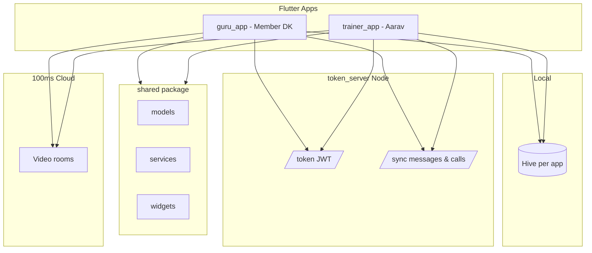

# Architecture

## Overview

## Layers

| Layer | Location | Responsibility |
|-------|----------|----------------|
| UI | `guru_app/lib`, `trainer_app/lib` | Screens, navigation, Riverpod (Phase 4+) |
| Domain | `shared/lib/services` | Auth, Chat, Call, Log abstractions |
| Data | `shared/lib/services/local_store.dart` | Hive persistence, streams |
| RTC | Apps + `token_server` | JWT mint, `hmssdk_flutter` join |

## Data flow — chat (target)

1. User sends message → `LocalChatService` writes Hive → POST `/sync/messages`
2. Other app polls GET `/sync/messages` → updates UI stream
3. Typing/read simulated locally (400–800ms)

## Data flow — video call (target)

1. DK creates `CallRequest` (pending)
2. Trainer approves → `RoomMeta` + system chat message
3. Within 10 min of slot → Join → token server → 100ms join
4. End call → `SessionLog` + rating sheets

## Seeded users

- Member: **DK** (`member_dk`)
- Trainer: **Aarav** (`trainer_aarav`)
- Default chat: `chat_dk_aarav`
